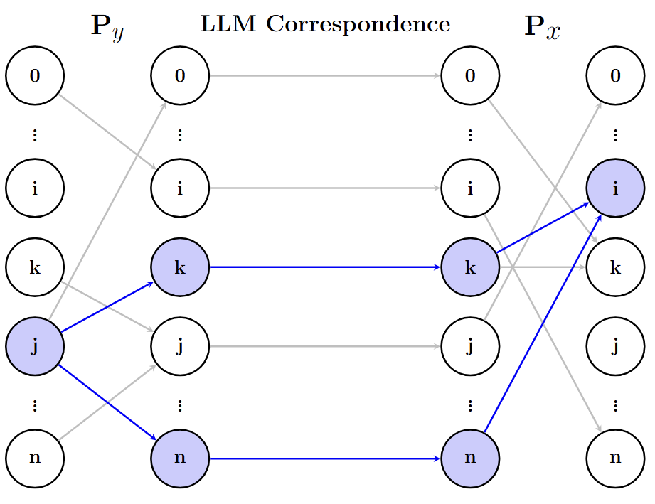

# Inv-Entropy: Uncertainty-Quantification-for-LLMs
A Fully Probabilistic Framework for Uncertainty Quantification in LLMs.
## Abstract
Large language models (LLMs) have transformed natural language processing, but their reliable deployment requires effective uncertainty quantification (UQ). Existing UQ methods are often heuristic and lack a fully probabilistic foundation. This paper begins by providing a theoretical justification for the role of perturbations in UQ for LLMs. We then introduce a dual random walk perspective, modeling input–output pairs as two Markov chains with transition probabilities defined by semantic similarity. Building on this, we propose a fully probabilistic framework based on an inverse model, which quantifies uncertainty by evaluating the diversity of the input space conditioned on a given output through systematic perturbations. Within this framework, we define a new uncertainty measure, Inv-Entropy. A key strength of our framework is its flexibility: it supports various definitions of uncertainty measures, embeddings, perturbation strategies, and similarity metrics. We also propose GAAP, a perturbation algorithm based on genetic algorithms, which enhances the diversity of sampled inputs. In addition, we introduce a new evaluation metric, Temperature Sensitivity of Uncertainty (TSU), which directly assesses uncertainty without relying on correctness as a proxy. Extensive experiments demonstrate that Inv-Entropy outperforms existing semantic UQ methods.


## Model Overview

The figure below illustrates the core structure of our proposed dual random walk framework:



## python package
To compute Inv-Entropy easily, we provide a Python package. You can find full documentation at **[pypi:inventropy]https://pypi.org/project/inventropy/**
### Quick Start： Basic Usage (OpenAI)

```python
import openai
from inventropy import calculate_inv_entropy

# Set your OpenAI API key
openai.api_key = "your-api-key-here"

# Calculate inverse entropy for a question
question = "What is artificial intelligence?"
mean_inv_entropy = calculate_inv_entropy(question)

print(f"Inverse Entropy: {mean_inv_entropy:.4f}")
```

## Running Inv-Entropy and Reproducing the Evaluation in Our Paper
  - Complete the paraphrasing, response generation, and correctness evaluation by running
    ```
    python pipeline_agent.py inputfile.csv
    ```
  - After running the command above, a folder named inputfile will be created. To compute the probability in the fully probabilistic framework and uncertainty measures including inv-entropy and evaluation metrics including AUROC, PRR, and Brier Score, run:
    ```
    python pipeline_metric.py inputfile
    ```
    
## Running Baseline Models and Their Evaluation
  - To run the Semantic Entropy baseline, use:
    ```
    python semantic_entropy.py --input inputfile.csv  --output outputpath
    ```
  - For other benchmark models, specify the desired estimator using --estimator and optionally adjust the sampling temperature using --temperature. For example:
    ```
    python lmpolygraph.py --estimator "DegMat" --input_path inputfile.csv   --output_path outputpath
    ```
    
## Structure of inputfile.csv
An example input file is `trivia5.csv`. It should contain two columns:
- **`question`**: The text of the question.  
- **`value`**: The correct answer to the question.

You can use any dataset that follows this structure to run our code.


## API Usage
- **ChatGPT (OpenAI)**:  
  To use ChatGPT in our code, you need an OpenAI API key.  
  - Get your API key: [OpenAI API Keys](https://platform.openai.com/settings/organization/api-keys)  
  - Documentation: [OpenAI API Docs](https://platform.openai.com/docs)

- **LLaMA (Hugging Face)**:  
  To use LLaMA models, you need a Hugging Face access token.  
  - Get your token: [Hugging Face Access Tokens](https://huggingface.co/settings/tokens)  
  - Documentation: [Hugging Face Docs](https://huggingface.co/docs)

## Dataset
We conducted experiments using five different datasets. You can download each of them from the following links:

- **[TriviaQA](https://huggingface.co/datasets/mandarjoshi/trivia_qa)**  
- **[SciQ](https://huggingface.co/datasets/allenai/sciq)**  
- **[Natural Questions](https://huggingface.co/datasets/lighteval/natural_questions_clean)**  
- **[MMLU](https://huggingface.co/datasets/cais/mmlu)**  
- **[GSM8K](https://huggingface.co/datasets/openai/gsm8k)**

